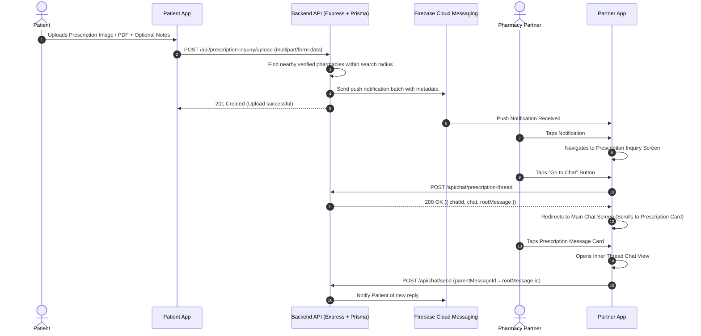

# Prescription Inquiry & Threaded Chat System - Flutter Integration Guide

This guide provides a step-by-step walkthrough for Flutter developers to integrate the **Prescription Inquiry Notification** flow and **Threaded Prescription Chat System**.

---

## 1. System Overview & User Flow



---

## 2. Notification Data Payload Structure

When a patient uploads a prescription inquiry, FCM sends a push notification payload to all nearby pharmacy partners:

### FCM Data Payload (`RemoteMessage.data`):
```json
{
  "type": "PRESCRIPTION_INQUIRY",
  "patientId": "c0a80101-0000-0000-0000-000000000001",
  "patientName": "John Doe",
  "patientPhotoUrl": "https://supabase-url/storage/v1/object/public/avatars/john.jpg",
  "prescriptionUrl": "https://supabase-url/storage/v1/object/public/prescriptions/patient_123.jpg",
  "notes": "Need urgent delivery for blood pressure medicine"
}
```

---

## 3. Backend API Reference

Base URL: `https://your-domain.com/api`  
All endpoints require `Authorization: Bearer <supabase-access-token>` header.

### A. Upload Prescription (Patient Panel)
* **Endpoint**: `POST /api/prescription-inquiry/upload`
* **Content-Type**: `multipart/form-data`
* **Form Fields**:
  * `prescription` (File, required): Image (JPG/PNG) or PDF.
  * `notes` (String, optional): Caption or notes from patient.
* **Response `(201 Created)`**:
```json
{
  "success": true,
  "data": {
    "prescriptionUrl": "https://supabase-url.../prescriptions/xyz.jpg",
    "patientId": "c0a80101-0000-0000-0000-000000000001",
    "patientName": "John Doe",
    "patientPhotoUrl": "https://.../photo.jpg",
    "notes": "Need urgent delivery",
    "nearbyPharmaciesFound": 5,
    "notificationsSent": 5,
    "searchRadiusKm": 5
  },
  "message": "Prescription uploaded. 5 nearby pharmacy partners notified."
}
```

---

### B. Initialize / Open Prescription Thread
* **Endpoint**: `POST /api/chat/prescription-thread`
* **Content-Type**: `application/json`
* **Body**:
```json
{
  "patientId": "c0a80101-0000-0000-0000-000000000001",
  "prescriptionUrl": "https://supabase-url.../prescriptions/xyz.jpg",
  "notes": "Need urgent delivery for blood pressure medicine"
}
```
* **Response `(200 OK)`**:
```json
{
  "success": true,
  "data": {
    "chatId": "chat-uuid-1234",
    "chat": {
      "id": "chat-uuid-1234",
      "patientId": "c0a80101-0000-0000-0000-000000000001",
      "partnerId": "partner-uuid-5678",
      "patientName": "John Doe",
      "partnerName": "City Health Pharmacy",
      "lastMessage": "📷 Prescription Inquiry",
      "lastMessageTime": "2026-07-23T11:00:00.000Z"
    },
    "rootMessage": {
      "id": "msg-uuid-9999",
      "chatId": "chat-uuid-1234",
      "senderId": "c0a80101-0000-0000-0000-000000000001",
      "senderRole": "PATIENT",
      "content": "Need urgent delivery for blood pressure medicine",
      "imageUrl": "https://supabase-url.../prescriptions/xyz.jpg",
      "isPrescription": true,
      "parentMessageId": null,
      "replyCount": 0,
      "createdAt": "2026-07-23T11:00:00.000Z"
    }
  }
}
```

---

### C. List User Chats
* **Endpoint**: `GET /api/chat/my-chats`
* **Response `(200 OK)`**:
```json
{
  "success": true,
  "data": {
    "chats": [
      {
        "id": "chat-uuid-1234",
        "patientId": "c0a80101...",
        "partnerId": "partner-uuid...",
        "patientName": "John Doe",
        "partnerName": "City Health Pharmacy",
        "lastMessage": "📷 Prescription Inquiry",
        "lastMessageTime": "2026-07-23T11:00:00.000Z",
        "partnerUnreadCount": 1,
        "patientUnreadCount": 0
      }
    ]
  }
}
```

---

### D. Fetch Main Root Messages of a Chat
* **Endpoint**: `GET /api/chat/:chatId/messages`
* **Response `(200 OK)`**:
```json
{
  "success": true,
  "data": {
    "chat": { ... },
    "messages": [
      {
        "id": "msg-uuid-9999",
        "chatId": "chat-uuid-1234",
        "senderId": "c0a801...",
        "senderRole": "PATIENT",
        "content": "Need urgent delivery for blood pressure medicine",
        "imageUrl": "https://supabase-url.../prescriptions/xyz.jpg",
        "isPrescription": true,
        "parentMessageId": null,
        "replyCount": 2,
        "createdAt": "2026-07-23T11:00:00.000Z"
      }
    ]
  }
}
```

---

### E. Fetch Thread Reply Messages (Inner Thread View)
* **Endpoint**: `GET /api/chat/thread/:parentMessageId`
* **Response `(200 OK)`**:
```json
{
  "success": true,
  "data": {
    "parentMessage": {
      "id": "msg-uuid-9999",
      "content": "Need urgent delivery for blood pressure medicine",
      "imageUrl": "https://supabase-url.../prescriptions/xyz.jpg",
      "isPrescription": true,
      "replyCount": 2
    },
    "replies": [
      {
        "id": "reply-1",
        "chatId": "chat-uuid-1234",
        "senderId": "partner-uuid-5678",
        "senderRole": "PARTNER",
        "content": "Hello! We have all medicines in stock.",
        "parentMessageId": "msg-uuid-9999",
        "createdAt": "2026-07-23T11:05:00.000Z"
      },
      {
        "id": "reply-2",
        "chatId": "chat-uuid-1234",
        "senderId": "partner-uuid-5678",
        "senderRole": "PARTNER",
        "content": "Total cost will be $45. Shall we prepare the order?",
        "parentMessageId": "msg-uuid-9999",
        "createdAt": "2026-07-23T11:06:00.000Z"
      }
    ]
  }
}
```

---

### F. Send Message (Root or Thread Reply)
* **Endpoint**: `POST /api/chat/send`
* **Body**:
```json
{
  "chatId": "chat-uuid-1234",
  "content": "Yes, please prepare the order for pickup.",
  "parentMessageId": "msg-uuid-9999" // <-- Include parentMessageId to send reply inside thread
}
```
* **Response `(201 Created)`**:
```json
{
  "success": true,
  "data": {
    "message": {
      "id": "reply-3",
      "chatId": "chat-uuid-1234",
      "senderId": "c0a801...",
      "senderRole": "PATIENT",
      "content": "Yes, please prepare the order for pickup.",
      "parentMessageId": "msg-uuid-9999",
      "createdAt": "2026-07-23T11:10:00.000Z"
    }
  }
}
```

---

## 4. Flutter Client Implementation Code

### Step 1: Handle FCM Push Notification Tap in `main.dart`

```dart
import 'package:firebase_messaging/firebase_messaging.dart';
import 'package:flutter/material.dart';

void setupFcmListeners(BuildContext context) {
  // App opened from terminated state
  FirebaseMessaging.instance.getInitialMessage().then((RemoteMessage? message) {
    if (message != null) {
      _handleNotificationNavigation(context, message.data);
    }
  });

  // App opened from background state
  FirebaseMessaging.onMessageOpenedApp.listen((RemoteMessage message) {
    _handleNotificationNavigation(context, message.data);
  });
}

void _handleNotificationNavigation(BuildContext context, Map<String, dynamic> data) {
  final type = data['type'];
  
  if (type == 'PRESCRIPTION_INQUIRY') {
    Navigator.push(
      context,
      MaterialPageRoute(
        builder: (_) => PrescriptionInquiryScreen(
          patientId: data['patientId'] ?? '',
          patientName: data['patientName'] ?? 'Patient',
          patientPhotoUrl: data['patientPhotoUrl'],
          prescriptionUrl: data['prescriptionUrl'] ?? '',
          notes: data['notes'],
        ),
      ),
    );
  } else if (type == 'CHAT_MESSAGE') {
    final chatId = data['chatId'];
    final parentMessageId = data['parentMessageId'];
    
    if (parentMessageId != null && parentMessageId.isNotEmpty) {
      // Open inner thread directly
      Navigator.push(
        context,
        MaterialPageRoute(
          builder: (_) => ThreadChatScreen(parentMessageId: parentMessageId),
        ),
      );
    } else if (chatId != null && chatId.isNotEmpty) {
      // Open main chat screen
      Navigator.push(
        context,
        MaterialPageRoute(
          builder: (_) => MainChatScreen(chatId: chatId),
        ),
      );
    }
  }
}
```

---

### Step 2: Prescription Inquiry Screen with "Go to Chat" Button

```dart
import 'package:flutter/material.dart';
import 'package:http/http.dart' as http;
import 'dart:convert';

class PrescriptionInquiryScreen extends StatefulWidget {
  final String patientId;
  final String patientName;
  final String? patientPhotoUrl;
  final String prescriptionUrl;
  final String? notes;

  const PrescriptionInquiryScreen({
    Key? key,
    required this.patientId,
    required this.patientName,
    this.patientPhotoUrl,
    required this.prescriptionUrl,
    this.notes,
  }) : super(key: key);

  @override
  State<PrescriptionInquiryScreen> createState() => _PrescriptionInquiryScreenState();
}

class _PrescriptionInquiryScreenState extends State<PrescriptionInquiryScreen> {
  bool _isLoading = false;

  Future<void> _navigateToChat() async {
    setState(() => _isLoading = true);

    try {
      final token = await getAuthToken(); // Your token retrieval method
      final response = await http.post(
        Uri.parse('https://your-domain.com/api/chat/prescription-thread'),
        headers: {
          'Content-Type': 'application/json',
          'Authorization': 'Bearer $token',
        },
        body: jsonEncode({
          'patientId': widget.patientId,
          'prescriptionUrl': widget.prescriptionUrl,
          'notes': widget.notes,
        }),
      );

      final resData = jsonDecode(response.body);

      if (response.statusCode == 200 && resData['success'] == true) {
        final chatId = resData['data']['chatId'];
        final rootMessage = resData['data']['rootMessage'];

        if (!mounted) return;

        // Redirect to Main Chat Screen with prescription thread opened
        Navigator.pushReplacement(
          context,
          MaterialPageRoute(
            builder: (_) => MainChatScreen(
              chatId: chatId,
              initialRootMessageId: rootMessage['id'],
            ),
          ),
        );
      } else {
        ScaffoldMessenger.of(context).showSnackBar(
          SnackBar(content: Text(resData['message'] ?? 'Failed to open chat')),
        );
      }
    } catch (e) {
      ScaffoldMessenger.of(context).showSnackBar(
        SnackBar(content: Text('Error connecting to server: $e')),
      );
    } finally {
      if (mounted) setState(() => _isLoading = false);
    }
  }

  @override
  Widget build(BuildContext context) {
    return Scaffold(
      appBar: AppBar(title: const Text('Prescription Inquiry')),
      body: SingleChildScrollView(
        padding: const EdgeInsets.all(16.0),
        child: Column(
          crossAxisAlignment: CrossAxisAlignment.start,
          children: [
            // Patient Header
            Row(
              children: [
                CircleAvatar(
                  radius: 24,
                  backgroundImage: widget.patientPhotoUrl != null
                      ? NetworkImage(widget.patientPhotoUrl!)
                      : null,
                  child: widget.patientPhotoUrl == null
                      ? Text(widget.patientName[0].toUpperCase())
                      : null,
                ),
                const SizedBox(width: 12),
                Text(
                  widget.patientName,
                  style: const TextStyle(fontSize: 18, fontWeight: FontWeight.bold),
                ),
              ],
            ),
            const SizedBox(height: 16),

            // Patient Notes / Caption
            if (widget.notes != null && widget.notes!.isNotEmpty) ...[
              Text(
                'Note: ${widget.notes}',
                style: const TextStyle(fontSize: 15, fontStyle: FontStyle.italic),
              ),
              const SizedBox(height: 16),
            ],

            // Prescription Image Preview
            ClipRRect(
              borderRadius: BorderRadius.circular(12),
              child: Image.network(
                widget.prescriptionUrl,
                fit: BoxFit.cover,
                errorBuilder: (_, __, ___) => const Center(
                  child: Icon(Icons.picture_as_pdf, size: 64, color: Colors.red),
                ),
              ),
            ),
            const SizedBox(height: 24),

            // Go to Chat Button
            SizedBox(
              width: double.infinity,
              height: 50,
              child: ElevatedButton.icon(
                onPressed: _isLoading ? null : _navigateToChat,
                icon: _isLoading
                    ? const CircularProgressIndicator(color: Colors.white)
                    : const Icon(Icons.chat),
                label: Text(
                  _isLoading ? 'Opening Chat...' : 'Go to Chat',
                  style: const TextStyle(fontSize: 16, fontWeight: FontWeight.bold),
                ),
                style: ElevatedButton.styleFrom(
                  backgroundColor: Colors.blueAccent,
                  shape: RoundedRectangleBorder(
                    borderRadius: BorderRadius.circular(8),
                  ),
                ),
              ),
            ),
          ],
        ),
      ),
    );
  }
}
```

---

### Step 3: Main Chat Screen & Prescription Thread Message Card

```dart
class MainChatScreen extends StatefulWidget {
  final String chatId;
  final String? initialRootMessageId;

  const MainChatScreen({
    Key? key,
    required this.chatId,
    this.initialRootMessageId,
  }) : super(key: key);

  @override
  State<MainChatScreen> createState() => _MainChatScreenState();
}

class _MainChatScreenState extends State<MainChatScreen> {
  List<dynamic> _messages = [];
  bool _isLoading = true;

  @override
  void initState() {
    super.initState();
    _fetchChatMessages();
  }

  Future<void> _fetchChatMessages() async {
    final token = await getAuthToken();
    final res = await http.get(
      Uri.parse('https://your-domain.com/api/chat/${widget.chatId}/messages'),
      headers: {'Authorization': 'Bearer $token'},
    );

    final data = jsonDecode(res.body);
    if (res.statusCode == 200) {
      setState(() {
        _messages = data['data']['messages'];
        _isLoading = false;
      });
    }
  }

  void _openThread(String parentMessageId) {
    Navigator.push(
      context,
      MaterialPageRoute(
        builder: (_) => ThreadChatScreen(parentMessageId: parentMessageId),
      ),
    ).then((_) => _fetchChatMessages()); // Refresh counts on return
  }

  @override
  Widget build(BuildContext context) {
    return Scaffold(
      appBar: AppBar(title: const Text('Chat')),
      body: _isLoading
          ? const Center(child: CircularProgressIndicator())
          : ListView.builder(
              itemCount: _messages.length,
              padding: const EdgeInsets.all(12),
              itemBuilder: (context, index) {
                final msg = _messages[index];

                // If message is a root Prescription Inquiry
                if (msg['isPrescription'] == true) {
                  return GestureDetector(
                    onTap: () => _openThread(msg['id']),
                    child: Card(
                      margin: const EdgeInsets.symmetric(vertical: 8),
                      elevation: 3,
                      shape: RoundedRectangleBorder(
                        borderRadius: BorderRadius.circular(12),
                      ),
                      child: Padding(
                        padding: const EdgeInsets.all(12.0),
                        child: Column(
                          crossAxisAlignment: CrossAxisAlignment.start,
                          children: [
                            Row(
                              children: const [
                                Icon(Icons.receipt_long, color: Colors.blueAccent),
                                SizedBox(width: 8),
                                Text(
                                  'Prescription Inquiry Thread',
                                  style: TextStyle(fontWeight: FontWeight.bold),
                                ),
                              ],
                            ),
                            const SizedBox(height: 8),
                            ClipRRect(
                              borderRadius: BorderRadius.circular(8),
                              child: Image.network(
                                msg['imageUrl'],
                                height: 180,
                                width: double.infinity,
                                fit: BoxFit.cover,
                              ),
                            ),
                            const SizedBox(height: 8),
                            Text(
                              msg['content'] ?? '',
                              style: const TextStyle(fontSize: 14),
                            ),
                            const Divider(),
                            Row(
                              mainAxisAlignment: MainAxisAlignment.spaceBetween,
                              children: [
                                Text(
                                  '${msg['replyCount'] ?? 0} replies',
                                  style: const TextStyle(
                                    color: Colors.blueAccent,
                                    fontWeight: FontWeight.w600,
                                  ),
                                ),
                                const Icon(Icons.arrow_forward_ios, size: 14, color: Colors.grey),
                              ],
                            ),
                          ],
                        ),
                      ),
                    ),
                  );
                }

                // Normal Root Message
                return ListTile(
                  title: Text(msg['content'] ?? ''),
                  subtitle: Text(msg['senderRole']),
                );
              },
            ),
    );
  }
}
```

---

### Step 4: Inner Thread Chat Screen (Thread Replies)

```dart
class ThreadChatScreen extends StatefulWidget {
  final String parentMessageId;

  const ThreadChatScreen({Key? key, required this.parentMessageId}) : super(key: key);

  @override
  State<ThreadChatScreen> createState() => _ThreadChatScreenState();
}

class _ThreadChatScreenState extends State<ThreadChatScreen> {
  dynamic _parentMessage;
  List<dynamic> _replies = [];
  bool _isLoading = true;
  final TextEditingController _replyController = TextEditingController();

  @override
  void initState() {
    super.initState();
    _fetchThread();
  }

  Future<void> _fetchThread() async {
    final token = await getAuthToken();
    final res = await http.get(
      Uri.parse('https://your-domain.com/api/chat/thread/${widget.parentMessageId}'),
      headers: {'Authorization': 'Bearer $token'},
    );

    final data = jsonDecode(res.body);
    if (res.statusCode == 200) {
      setState(() {
        _parentMessage = data['data']['parentMessage'];
        _replies = data['data']['replies'];
        _isLoading = false;
      });
    }
  }

  Future<void> _sendReply() async {
    final text = _replyController.text.trim();
    if (text.isEmpty) return;

    _replyController.clear();
    final token = await getAuthToken();

    final res = await http.post(
      Uri.parse('https://your-domain.com/api/chat/send'),
      headers: {
        'Content-Type': 'application/json',
        'Authorization': 'Bearer $token',
      },
      body: jsonEncode({
        'chatId': _parentMessage['chatId'],
        'content': text,
        'parentMessageId': widget.parentMessageId,
      }),
    );

    if (res.statusCode == 201) {
      _fetchThread(); // Refresh thread
    }
  }

  @override
  Widget build(BuildContext context) {
    return Scaffold(
      appBar: AppBar(title: const Text('Prescription Thread')),
      body: _isLoading
          ? const Center(child: CircularProgressIndicator())
          : Column(
              children: [
                // Parent Prescription Header Widget
                Container(
                  padding: const EdgeInsets.all(12),
                  color: Colors.grey.shade100,
                  child: Row(
                    children: [
                      Image.network(
                        _parentMessage['imageUrl'],
                        width: 60,
                        height: 60,
                        fit: BoxFit.cover,
                      ),
                      const SizedBox(width: 12),
                      Expanded(
                        child: Text(
                          _parentMessage['content'] ?? 'Prescription Inquiry',
                          maxLines: 2,
                          overflow: TextOverflow.ellipsis,
                          style: const TextStyle(fontWeight: FontWeight.bold),
                        ),
                      ),
                    ],
                  ),
                ),
                const Divider(height: 1),

                // Thread Replies List
                Expanded(
                  child: ListView.builder(
                    itemCount: _replies.length,
                    itemBuilder: (context, index) {
                      final reply = _replies[index];
                      return ListTile(
                        title: Text(reply['content']),
                        subtitle: Text(reply['senderRole']),
                      );
                    },
                  ),
                ),

                // Reply Input Field
                Padding(
                  padding: const EdgeInsets.all(8.0),
                  child: Row(
                    children: [
                      Expanded(
                        child: TextField(
                          controller: _replyController,
                          decoration: const InputDecoration(
                            hintText: 'Reply to this prescription inquiry...',
                            border: OutlineInputBorder(),
                          ),
                        ),
                      ),
                      IconButton(
                        icon: const Icon(Icons.send, color: Colors.blueAccent),
                        onPressed: _sendReply,
                      ),
                    ],
                  ),
                ),
              ],
            ),
    );
  }
}
```
