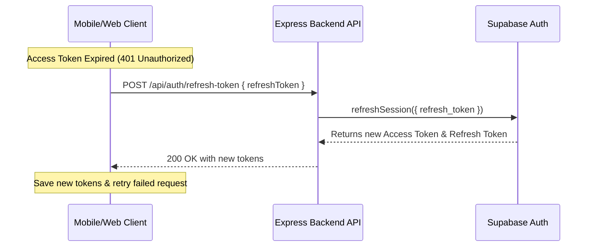

# Refresh Token Integration Guide

This guide details how to integrate the Token Refresh flow in client applications (Flutter, React, etc.) using the Indopo Backend APIs (powered by Supabase Auth).

---

## 1. Flow Overview



---

## 2. API Reference

### Refresh Access Token
Exchanges a valid refresh token for a new set of tokens (access token and refresh token).

- **URL**: `/api/auth/refresh-token`
- **Method**: `POST`
- **Auth Required**: No (Public)
- **Headers**:
  - `Content-Type: application/json`
- **Request Body**:
  ```json
  {
    "refreshToken": "your-refresh-token-here"
  }
  ```

- **Response (200 OK)**:
  ```json
  {
    "success": true,
    "message": "Token refreshed successfully.",
    "data": {
      "user": {
        "id": "user-uuid",
        "email": "user@example.com",
        "role": "authenticated",
        ...
      },
      "session": {
        "access_token": "new-access-token-jwt",
        "token_type": "bearer",
        "expires_in": 3600,
        "refresh_token": "new-refresh-token",
        "user": { ... }
      },
      "accessToken": "new-access-token-jwt",
      "refreshToken": "new-refresh-token"
    }
  }
  ```

---

## 3. Frontend Integration Steps

### Option A: Flutter (Dio Interceptor)
Using the popular `dio` package, you can set up a `QueuedInterceptor` to handle token refresh seamlessly across concurrent requests.

```dart
import 'package:dio/dio.dart';

class AuthInterceptor extends QueuedInterceptor {
  final Dio dio;
  
  AuthInterceptor(this.dio);

  // Helper to fetch stored tokens
  Future<String?> getAccessToken() async => /* Load from secure storage */;
  Future<String?> getRefreshToken() async => /* Load from secure storage */;
  Future<void> saveTokens(String access, String refresh) async => /* Save to secure storage */;

  @override
  void onRequest(RequestOptions options, RequestInterceptorHandler handler) async {
    final token = await getAccessToken();
    if (token != null) {
      options.headers['Authorization'] = 'Bearer $token';
    }
    return handler.next(options);
  }

  @override
  void onError(DioException err, ErrorInterceptorHandler handler) async {
    // Check if error is 401 Unauthorized
    if (err.response?.statusCode == 401) {
      final refreshToken = await getRefreshToken();
      
      if (refreshToken != null) {
        try {
          // Call Refresh Token API
          final refreshResponse = await dio.post(
            'https://your-backend-url.com/api/auth/refresh-token',
            data: {'refreshToken': refreshToken},
          );

          if (refreshResponse.statusCode == 200) {
            final newAccessToken = refreshResponse.data['data']['accessToken'];
            final newRefreshToken = refreshResponse.data['data']['refreshToken'];

            // Save the new tokens
            await saveTokens(newAccessToken, newRefreshToken);

            // Retry the original request with the new access token
            final options = err.requestOptions;
            options.headers['Authorization'] = 'Bearer $newAccessToken';
            
            final response = await dio.fetch(options);
            return handler.resolve(response);
          }
        } catch (e) {
          // Refresh failed (e.g., refresh token expired or revoked)
          // Handle Logout / Redirect to Login
          print('Refresh token expired, logging out...: $e');
        }
      }
    }
    return handler.next(err);
  }
}
```

---

### Option B: JavaScript / Web (Axios Interceptor)
For Web/React clients using `axios`, a similar interceptor can be constructed.

```typescript
import axios from 'axios';

const api = axios.create({
  baseURL: 'https://your-backend-url.com/api',
});

// Request Interceptor
api.interceptors.request.use(
  async (config) => {
    const token = localStorage.getItem('accessToken');
    if (token) {
      config.headers['Authorization'] = `Bearer ${token}`;
    }
    return config;
  },
  (error) => Promise.reject(error)
);

// Response Interceptor
api.interceptors.response.use(
  (response) => response,
  async (error) => {
    const originalRequest = error.config;
    
    if (error.response?.status === 401 && !originalRequest._retry) {
      originalRequest._retry = true;
      const refreshToken = localStorage.getItem('refreshToken');

      if (refreshToken) {
        try {
          const response = await axios.post('https://your-backend-url.com/api/auth/refresh-token', {
            refreshToken,
          });

          const { accessToken, refreshToken: newRefreshToken } = response.data.data;

          localStorage.setItem('accessToken', accessToken);
          localStorage.setItem('refreshToken', newRefreshToken);

          originalRequest.headers['Authorization'] = `Bearer ${accessToken}`;
          return api(originalRequest);
        } catch (refreshError) {
          // Token refresh failed, redirect to login
          localStorage.removeItem('accessToken');
          localStorage.removeItem('refreshToken');
          window.location.href = '/login';
          return Promise.reject(refreshError);
        }
      }
    }
    return Promise.reject(error);
  }
);
```
